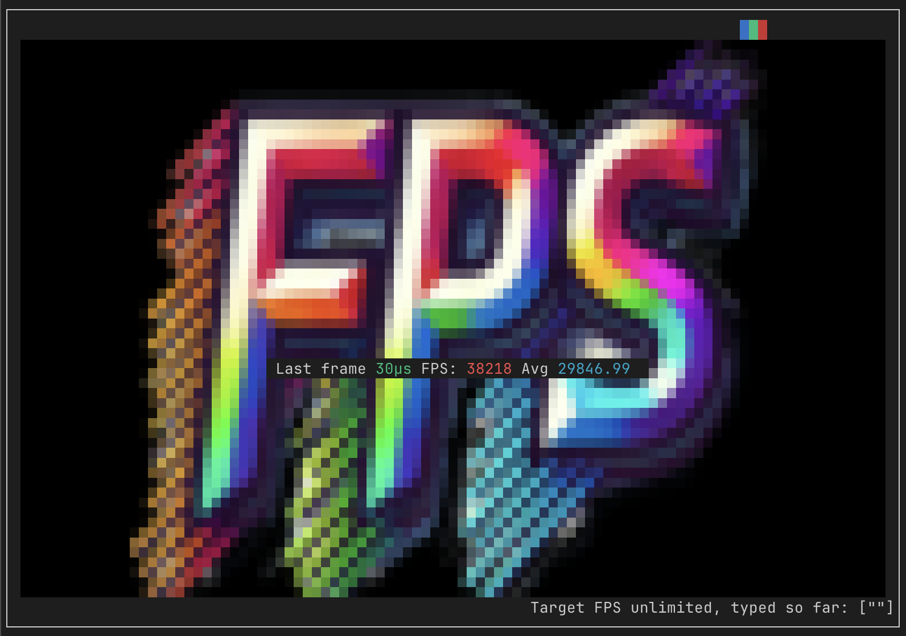
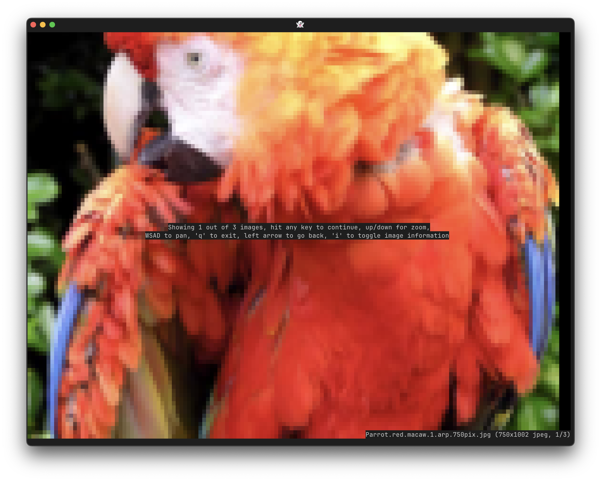
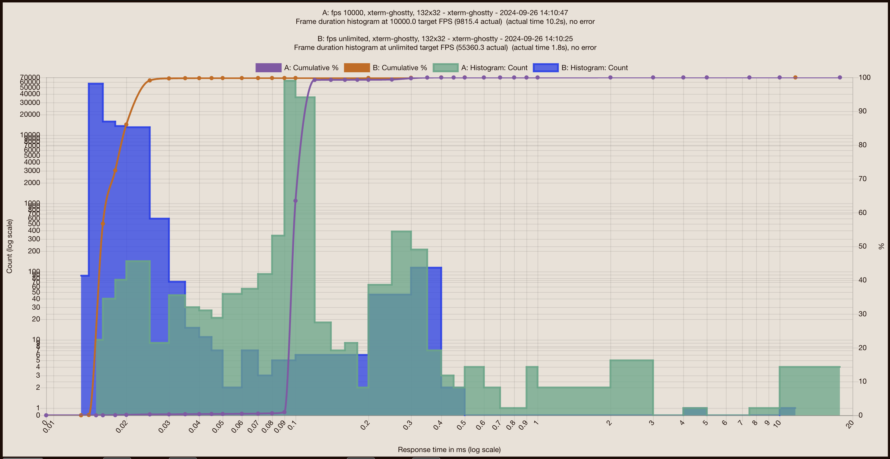
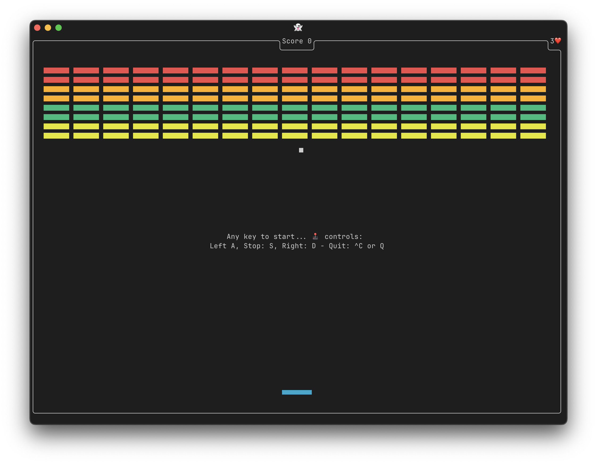

# terminal

Fortio's terminal has 2 distinct components and a number of utilities built on the second one.

Readline style terminal and more vs Low level ansipixels terminal control and drawing:


## fortio.org/terminal
[](https://pkg.go.dev/fortio.org/terminal)


`fortio.org/terminal` is a `readline` style library. It handles prompts, edit (like Ctrl-A for beginning of line etc...), navigating through history using arrow keys, loading and saving history from file, etc... It works on everywhere go does (including macOS, Windows (using Terminal app), Linux).

See [example/main.go](example/main.go) for a rather complete example/demo.

See the godoc above for details.

The [grol](https://github.com/grol-io/grol#grol) command line repl and others use this.

The implementations currently is a wrapper fully encapsulating (our fork of) [x/term](https://github.com/golang/term), i.e. [fortio.org/term](https://github.com/fortio/term) and new features like the interrupts handling (filters Ctrl-C ahead of term' reads)

## fortio.org/terminal/ansipixels
[](https://pkg.go.dev/fortio.org/terminal/ansipixels)

A much lower level library that allow direct control of both the input and the output of the terminal, including mouse tracking, clicks, drag events and modifiers, mousewheel decoding/querying and many functions to emit the corresponding [ANSI escape codes](https://en.wikipedia.org/wiki/ANSI_escape_code) (colors, cursor positioning etc).

Do feel free to use [fortio.org/progressbar](https://github.com/fortio/progressbar) as well

## FPS

The tagged release of `ansipixels` also includes a standalone binary, `fps`, that uses that package to test your terminal frames per second capabilities.
See the source [fps/fps.go](fps/fps.go)

You can get the binary from [releases](https://github.com/fortio/terminal/releases)

Or just run
```
CGO_ENABLED=0 go install fortio.org/terminal/fps@latest  # to install or just
CGO_ENABLED=0 go run fortio.org/terminal/fps@latest  # to run without install
```

or even
```
docker run -ti fortio/fps # but that's obviously slower
```

or
```
brew install fortio/tap/fps
```

Use the `-image` flag to pass a different image to load as background. Or use `-i` and fps is now just a terminal image viewer (in addition to keys, you can now zoom using the mousewheel, click to move the image - see `?` for help).

Pass an optional `maxfps` as argument.

E.g `fps -image my.jpg 60` will run at 60 fps with `my.jpg` as background.

After hitting any key to start the measurement, you can also resize the window at any time and fps will render with the new size.
Use `q` to stop.



Image viewer screenshot:



Detailed statistics are saved in a JSON files and can be visualized or compared by running [fortio report](https://github.com/fortio/fortio#installation)



Hot (!) off the press a new `-fire` mode for fps (with space to toggle on/off and `i` to turn off the text):


### Usage

Additional flags/command help:
```
fps 0.27.0 usage:
        fps [flags] [maxfps] or fps -i imagefiles...
or 1 of the special arguments
        fps {help|envhelp|version|buildinfo}
flags:
  -color
        If your terminal supports color, this will load image in (216) colors instead of monochrome
  -fire
        Show fire animation instead of RGB around the image
  -gray
        Convert the image to grayscale
  -i    Arguments are now images files to show, no FPS test (hit any key to continue)
  -image string
        Image file to display in monochrome in the background instead of the default one
  -n number of frames
        Start immediately an FPS test with the specified number of frames (default is interactive)
  -nobox
        Don't draw the box around the image, make the image full screen instead of 1 pixel less on all sides
  -nojson
        Don't output json file with results that otherwise get produced and can be visualized with fortio report
  -nomouse
        Disable mouse tracking
  -truecolor
        If your terminal supports truecolor, this will load image in truecolor (24bits) instead of monochrome (default true)
```

## Game of life

See [life/](life/) for a classic Conway's game of life black and white demo (with resizing, mouse edits, etc... supported).

Same installation as above, just replace `fps` by `life`.


## Brick

Play an old time favorite, or watch replays of saved games... or even let the computer play!

See the options below.



```
brick 0.20.0 usage:
	brick [flags]
or 1 of the special arguments
	brick {help|envhelp|version|buildinfo}
flags:
  -autoplay
    	Computer plays mode
  -fps float
    	Frames per second (default 30)
  -lives int
    	Number of lives - 0 is infinite (default 3)
  -nodeath
    	No death mode
  -nosave
    	Don't save the game as JSON (default is to save)
  -replay game
    	Replay a game from a JSON file
  -seed seed
    	Random number generator seed, default (0) is time based
```

Like for the others, to try if you have go:
```shell
go run fortio.org/terminal/brick@latest
```
or pick a binary from the [releases](https://github.com/fortio/terminal/releases)


## Nocolor

`nocolor` is a very simple unix style filter ([source code](https://github.com/fortio/terminal/blob/main/nocolor/nocolor.go#L42), uses [ansipixels.AnsiClean](https://pkg.go.dev/fortio.org/terminal/ansipixels#AnsiClean)): it removes all ansi codes from the input stream and writes the filtered version, color free, to stdout.

To install if you have go:
```shell
go install fortio.org/terminal/nocolor@latest
# then
somethingProducingColors | nocolor
```

Or on a mac
```sh
brew install fortio/tap/nocolor
```

Or pick a binary from the [releases](https://github.com/fortio/terminal/releases)
