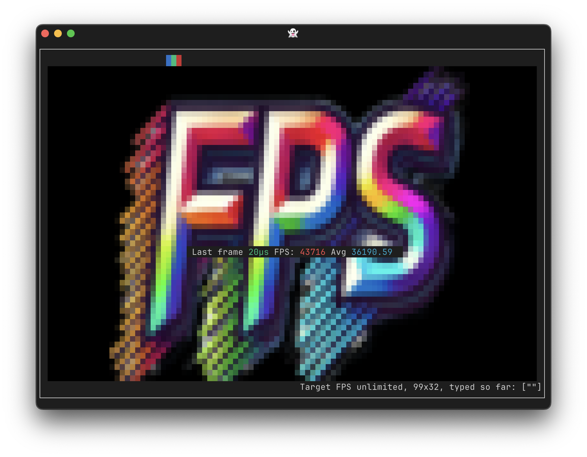

[](https://pkg.go.dev/fortio.org/terminal)
# terminal

Fortio's terminal is a `readline` style library. It handles prompts, edit (like Ctrl-A for beginning of line etc...), navigating through history using arrow keys, loading and saving history from file, etc... It works on everywhere go does (including macOS, Windows (using Terminal app), Linux).

See [example/main.go](example/main.go) for a rather complete example/demo.

See the godoc above for details.

The [grol](https://github.com/grol-io/grol#grol) command line repl and others use this.

The implementations currently is a wrapper fully encapsulating (our fork of) [x/term](https://github.com/golang/term), i.e. [fortio.org/term](https://github.com/fortio/term) and new features like the interrupts handling (filters Ctrl-C ahead of term' reads)

## FPS

There is also a new [ansipixels](https://pkg.go.dev/fortio.org/terminal/ansipixels) package for drawing on the terminal and the tagged release also include `fps` that uses that package to test your terminal frames per second capabilities.
See the source [ansipixels/fps/fps.go](ansipixels/fps/fps.go)

You can get the binary from [releases](https://github.com/fortio/terminal/releases)

Or just run
```
CGO_ENABLED=0 go install fortio.org/terminal/ansipixels/fps@latest
```

or even
```
docker run -ti fortio/fps # but that's obviously slower
```

or
```
brew install fortio/tap/fps
```


