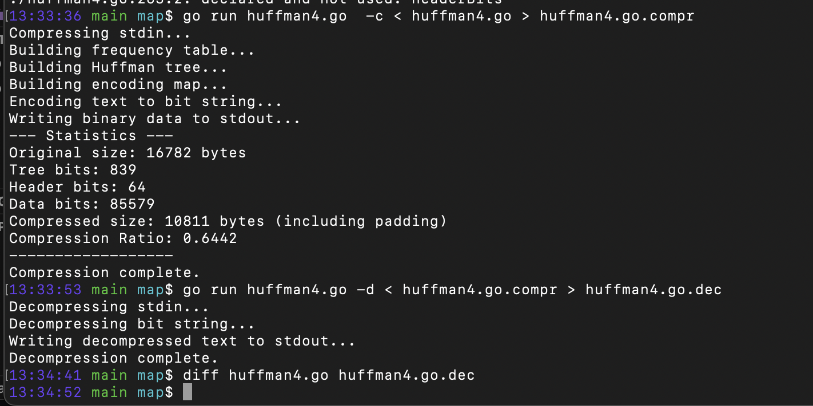

# blackjack

Game of blackjack demo using Ansipixels.

Running with `blackjack -green`:



## Install/run
Binary releases or tap or

```sh
go run fortio.org/terminal/blackjack@latest
```

## Usage

```
blackjack 0.35.5 usage:
	blackjack [flags]
or 1 of the special arguments
	blackjack {help|envhelp|version|buildinfo}
flags:
  -balance dollars
        Initial balance in dollars (default 100)
  -bet dollars
        Bet amount in dollars (default 10)
  -decks int
        Number of decks to use (default 4)
  -fps float
        Frames per second (for resize/refreshes/animations) (default 60)
  -green
        Use green instead of black around the cards
  -no-border
        Don't draw the border at all around the cards
  -wide
        Draw a wide border around the cards
```
