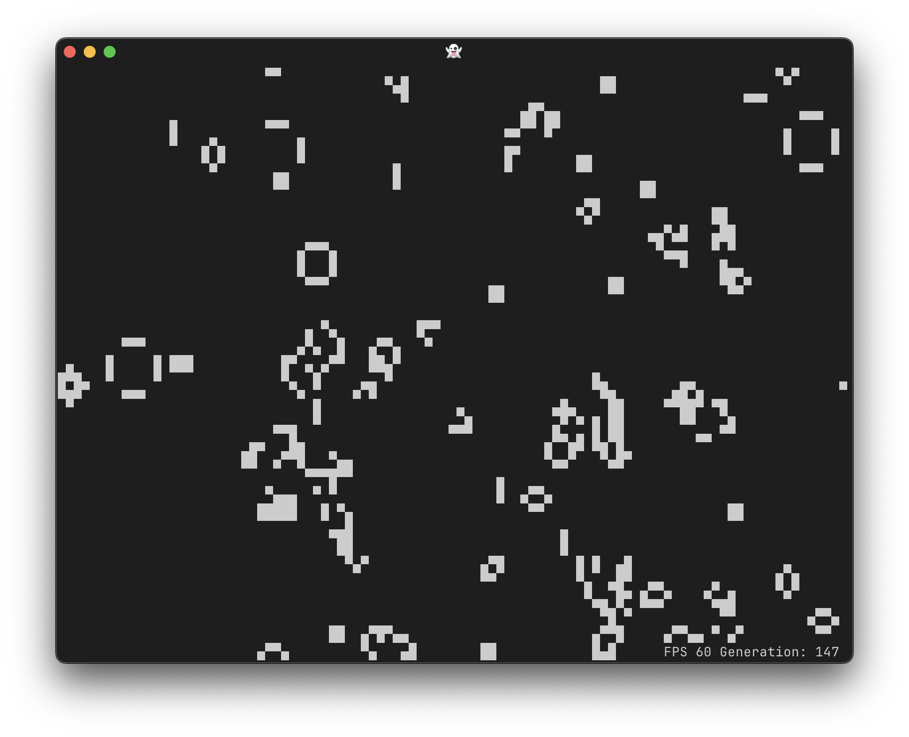

# Life

Game of life demo using Ansipixels.



## Install/run
Binary releases or tap or

```
go run fortio.org/terminal/life@latest
```

## Usage

```
life 0.19.0 usage:
	life [flags]
or 1 of the special arguments
	life {help|envhelp|version|buildinfo}
flags:
  -fill float
    	Random fill factor (0 to 1) (default 0.1)
  -fps float
    	Frames per second (default 60)
  -glider
    	Start with a glider (default is random)
```
